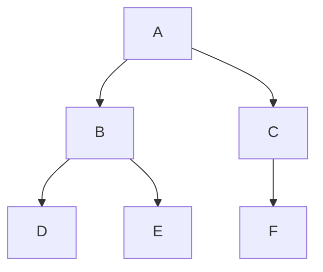
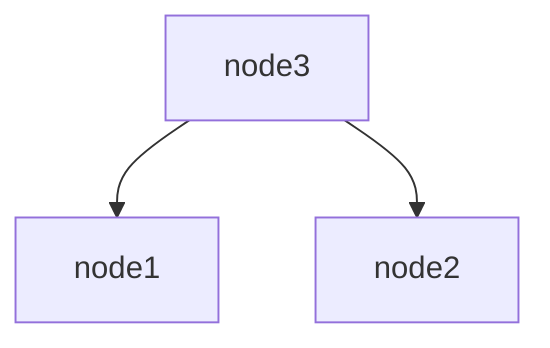

# 树

> n 个结点的有限集，或为空树(n=0)，或非空树。

对于非空树T：

- 有且只有一个根结点
- 除根结点以外的其余结点可分为m个互不相交的有限集T1, T2, ...
- 一棵树中的任意两个结点有且仅有唯一的路径连通

  


### 树的基本术语

- 结点
- 结点的度：结点拥有子树数
- 树的度：树内各结点度的最大值
- 叶子：度为0的结点称为叶子或终端结点
- 层次：结点的层次从根结点开始为第一层；任一结点的层次等于双亲的层次加1
- 深度：树中结点的最大层次成为树的深度或高度（上图的定义似乎和《数据结构C语言版》中深度定义有出入）


### 二叉树

> 由 n ( n >= 0 ) 个结点组成的集合。

对于非空二叉树T：

- 有且只有一个根结点
- 除了根结点外，其余结点为两个互不相交的子集T1、T2，称为T的左右子树，并且T1,T2本身也是二叉树


#### 和树的区别

- 二叉树每个结点最多只有2棵子树
- 子树有左右之分，不可颠倒


#### 性质

- 二叉树的第 ` i ` 层至多拥有`2^(i-1)`个结点
- 深度为 k 的二叉树至多总共有 `2^k-1` 个节点
- 如果其叶子结点数为n0，度为2的结点数为n2，则n0 = n2 + 1


**满二叉树**

深度为k，且有2^k - 1 个结点的二叉树


**完全二叉树**

深度为k的，有n个结点的二叉树，当且仅当其每一个结点都与深度为k的满二叉树中编号从1至n的结点一一对应时，称之为完全二叉树。

也就是说，除了最后一层，其它层子结点是满的，并且深度k那一层的子结点是满的，或者在右边缺少连续若干结点。




**平衡二叉树**

- 可以是一棵空树
- 非空树，左右子树的高度差绝对值不超过1，并且左右两棵子树都是一棵平衡二叉树

平衡二叉树的常用实现方法有 **红黑树**，**AVL树**，**替罪羊树**， **加权平衡树**， **伸展树** 等


**二叉树存储**

- 链式存储
- 顺序存储：如果存储的不是完全二叉树，会导致内存利用率低


**二叉树的遍历**

先序遍历

> 二叉树的先序遍历，就是先输出根结点，再遍历左子树，最后遍历右子树，遍历左子树和右子树的时候，同样遵循先序遍历的规则，也就是说，我们可以递归实现先序遍历





```go
package main

import "fmt"

func main() {
	node1 := TreeNode{data: "node1"}
	node2 := TreeNode{data: "node2"}
	node3 := TreeNode{data: "node3", left: &node1, right: &node2}
	showMsg(&node3)
}

type TreeNode struct {
	data string
	left *TreeNode
	right *TreeNode
}

func showMsg(node *TreeNode) {
	if node != nil {
		fmt.Println(node.data)
		showMsg(node.left)
		showMsg(node.right)
    } else {
        return
    }
} 
```


中序遍历

> 二叉树的中序遍历，就是先递归中序遍历左子树，再输出根结点的值，再递归中序遍历右子树，大家可以想象成一巴掌把树压扁，父结点被拍到了左子节点和右子节点的中间


```go
func showMsg(node *TreeNode) {
	if node != nil {
        showMsg(node.left)
		fmt.Println(node.data)
		showMsg(node.right)
    } else {
        return
    }
}
```


后序遍历

> 二叉树的后序遍历，就是先递归后序遍历左子树，再递归后序遍历右子树，最后输出根结点的值


```go
func showMsg(node *TreeNode) {
	if node != nil {
        showMsg(node.left)
		showMsg(node.right)
        fmt.Println(node.data)
    } else {
        return
    }
}
```

