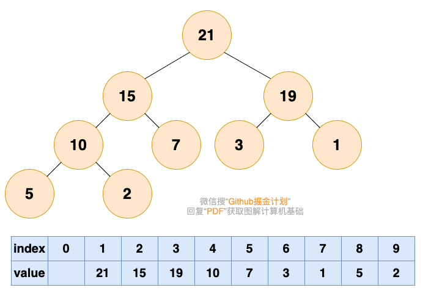

# 堆 Heap

堆实际上是一种树，满足以下条件：

- 堆中每一个节点值**都**大于等于（或小于等于）子树中所有节点的值


例如：


存在多次获取最大值和最小值，多次插入或删除数据时，可以使用堆


## 堆的分类

- 最大堆（大根堆）：每个节点的值都大于等于子树所有节点的值
- 最小堆（小根堆）：每个节点的值都小于等于子树所有节点的值


为了方便存储和索引，（二叉）堆可以用完全二叉树的形式来存储




## 堆的操作

插入元素和删除堆顶元素

- 插入元素

  1、将要插入的元素放到最后

  

  

  2、从底向上，如果父节点比该元素小，则该节点和父节点交换，直到无法交换

  

  


- 删除堆顶元素

  删除堆顶元素后，为了维持堆的特性，需要进行结构调整，这个过程称为**堆化**。

  1、自底而上：从根结点的直接节点，取较大的元素填充到根结点，并循环选出来的结点子树，将较大者移动到空位，直到堆的最底部。通俗来说，一个分公司的老大，升级到总公司了，原先分公司的总经理位置由公司内部晋升。

  > 该方式会造成空间浪费，因为空出来的子堆的空间可能处于数组中间位置，而新插入的元素则处于数组末尾。

  

  2、自顶而下：选取最后一个元素，填充到根结点，然后从根结点开始，比较直接子结点是否需要调换位置，直至不需要调换位置。通俗来说，石沉大海，先把石头提到水面，再扔下去；对比公司的例子来说，就是，最近入职一个员工直接空降到总公司，经过业绩考核（比较大小），再分配到再适合的公司岗位。

  > 避免自底而上方式造成空间浪费。


## 堆排序

可以分为两步：

- 第一步是建堆

  个人理解，如果是倒序排序，则建立最小堆，否则最大堆。因为假如是需要时倒序排序，最小堆取出堆顶元素并自顶而下堆化后，最后一个位置正好可以放置取出的最小值。

- 第二步是排序


假设数组：

```php
[22,36,28,74,43,45,98]

// 升序 --> 最大堆
[98, 43, 74, 22, 36, 28, 45]


// 倒序 --> 最小堆
[22, 36, 28, 74, 43, 45, 98]

```


升序

| index |  0   |                  1                  |  2   |  3   |  4   |  5   |  6   |  7   |
| ----- | :--: | :---------------------------------: | :--: | :--: | :--: | :--: | :--: | :--: |
| value |      | <span style="color: red;">98</span> |  43  |  74  |  22  |  36  |  28  |  45  |

取出98，自顶而下堆化

- 最后一个元素填位：45 43 74 22 36 28 
- 堆化开始：74 43 45 22 36 28 <span style="color: red;">98</span>
- 45 43 28 22 36 <span style="color: red;">74</span> <span style="color: red;">98</span>
- 43 36 28 22 <span style="color: red;">45</span> <span style="color: red;">74</span> <span style="color: red;">98</span>
- 36 22 28 <span style="color: red;">43</span> <span style="color: red;">45</span> <span style="color: red;">74</span> <span style="color: red;">98</span>
- 28 22 <span style="color: red;">36</span> <span style="color: red;">43</span> <span style="color: red;">45</span> <span style="color: red;">74</span> <span style="color: red;">98</span>
- <span style="color: red;">22</span> <span style="color: red;">28</span> <span style="color: red;">36</span> <span style="color: red;">43</span> <span style="color: red;">45</span> <span style="color: red;">74</span> <span style="color: red;">98</span>


