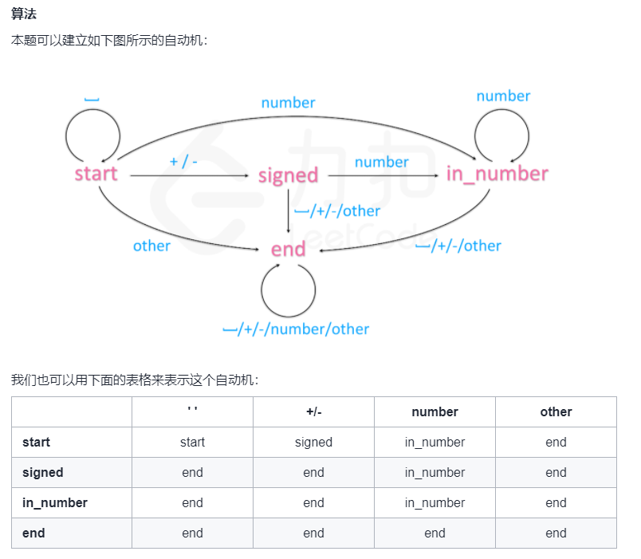

#### 字符串转换整数atoi


2021年10月18日

LeetCode 地址：[字符串转换整数 (atoi)](https://leetcode-cn.com/problems/string-to-integer-atoi/)





思路：自动机

我们的程序在每个时刻有一个状态 s，每次从序列中输入一个字符 c，并根据字符 c 转移到下一个状态 s'。这样，我们只需要建立一个覆盖所有情况的从 s 与 c 映射到 s' 的表格即可解决题目中的问题。


实例代码：

```php
class Solution {

    /**
     * @param String $s
     * @return Integer
     */
    function myAtoi($s) {
        $s = trim($s);
        $len = strlen($s);
        $automation = new Automaton();
        for ($i = 0; $i < $len; $i++) {
            $automation->get($s[$i]);
        }
        return (int)($automation->ans * $automation->sign);
    }
}

class Automaton {

    public $sign = 1;

    public $ans = 0;

    private $state = "start";

    private $stateTable = [
        'start' => [
            'start',
            'signed',
            'in_number',
            'end',
        ],
        'signed' => [
            'end',
            'end',
            'in_number',
            'end',
        ],
        'in_number' => [
            'end',
            'end',
            'in_number',
            'end',
        ],
        'end' => [
            'end',
            'end',
            'end',
            'end',
        ],
    ];

    public function get(string $c)
    {
        $this->state = $this->stateTable[$this->state][$this->getCol($c)];
        if ("in_number" === $this->state) {
            $this->ans = (int)($this->ans * 10  + $c);
            $this->ans = $this->sign === 1 ? min($this->ans, pow(2, 31) - 1) : min($this->ans, pow(2, 31));
        }
        if ("signed" === $this->state) {
            $this->sign = $c === '+' ? 1 : -1;
        }
    }

    private function getCol(string $c): int
    {
        if ($c === ' ') {
            return 0;
        }
        if ($c === '+' || $c === '-') {
            return 1;
        }
        if (is_numeric($c)) {
            return 2;
        }
        return 3;
    }
}
```

