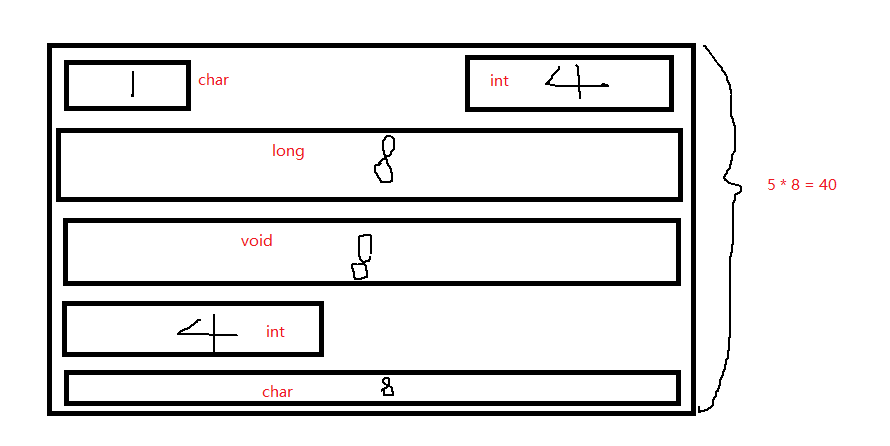
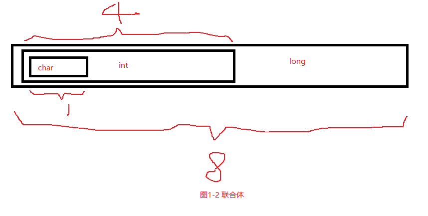

# PHP7底层设计与源码实现之 基本变量

> 本文所有内容摘录于《PHP 7底层设计与源码实现》，作者：陈雷等

## 基本知识

### 结构体和联合体

**结构体**

```c
struct test{
    char a;// 1
    int b;// 4
    long c;// 8
    void* d;// 8
    int e;// 4
    char* f;// 8
}
```

这里会涉及到结构体对齐，实际是会根据机器使用等于或大于实际使用的内存，会造成一定的浪费，但是也会因为内存对齐获得更快的存取速度。

如下图所示。


**联合体**

```c
union test{
    char a;// 1
    int b;// 4
    long c;// 8
}
```

实际使用的内存是8个字节，成员变量共享同一块内存。
如下图所示。



### 堆和栈

程序执行时的内存布局主要如下：

程序的堆和栈

| 区域 | 说明 |
| --- | --- |
| 栈区(stack) | 存储参数值、局部变量，维护函数调用关系等 |
| 堆区(heap) | 动态内存区域，随时申请和释放，程序自身要对内存泄露负责 |
| 全局区(静态区) | 存储全局和静态变量 |
| 字面量区 | 常量字符串存储区 |
| 程序代码区 | 存储二进制代码 |


接下来写一段C代码来理解一下各变量分别存在哪个段区，代码如下：

```c
int a = 0; // 全局初始化区
char *p1; // 全局未初始化区
main()
{
    static int b = 0; // 全局（静态）初始化区
    int c; // 栈
    char d[] = "abc"; // 栈
    char *p2;// 栈
    char *p3 = "hello";// hello\0 在常量区，p3 在栈
    p1 = (char*)malloc(10);// 堆区
    p2 = (char*)malloc(20);// 堆区
    strcpy(p1, "hello");// hello\0 放在字面量区，编译器可能将它和p3所指向的‘hello’会优化成一个地方
}
```

总体来说，栈上的变量是局部的，随着局部的空间销毁而销毁，由系统负责。

堆上的变量可以供全局访问，需要自行处理生命周期。


## 变量的类型和实现

>  `php`  中的变量使用结构体 `zval` 来表示。

### PHP5 的 zval

核心组成如下：

| 结构 | 说明 |
| --- | --- |
| `zvalue_value` | 联合体 |
| `zend_uchar` | type |
| `refcount__gc` | 5.3后引入，通过引用计数，进行垃圾回收 |
| `is_ref__gc` | 标记是否为引用类型 |

### PHP7 的 zval

`zval` 保留了 `value` 字段，但也支持更丰富的类型。且 `zval` 不再存储复杂类型的结构，复杂类型的数据通过指针操作，新的联合体中的 `value` 只占用8字节

` zval ` 多了2个重要的联合体字段u1 和 u2

u1 组成如下：

| 字段 | 说明 |
| --- | --- |
| type | 记录变量类型 |
| type_flag | 对应变量类型特有的标记 |
| const_flag | 常量类型的标记 |
| reserved | 保留字段 |


u2 组成如下：

| 字段 | 说明 |
| --- | --- |
| next | 解决哈希冲突问题，记录冲突的下一个元素位置 |
| cache_slot | 运行时缓存 |
| lineno | 文件执行的行号 |
| num_args | 函数调用时传入的参数个数 |
| fe_pos | 遍历数组时的当前位置 |
| fe_iter_idx | 针对对象遍历 |
| access_flags | 访问标志：public，protected，private |
| property_guard | 防止类中魔术方法的循环调用，比如__get、__set等 |

`zval`的结构变化，使得PHP7的zval占用更少的内存

### PHP7变量类型

除了常见的类型，新增了几个类型。

| 名称 | 说明 |
| --- | --- |
| IS_UNDEF | 标记未定义，表示数据可以被覆盖或删除。例如unset数组元素时，就是这样标记的。|
| IS_TRUE、IS_FALSE | IS_BOOL优化成两个，从而优化类型的检查 |
| IS_REFERENCE | 处理引用& |
| IS_INDIRECT | HashTable设计的不同，在解决全局符号表访问CV变量表的问题上，引入该类型 |
| IS_PTR | 指针类型，通常用于函数类型上，如声明函数或者方法 |
| _IS_ERROR | 校验zval类型是否合法 |

## 变量的作用域

### 全局变量

PHP底层维护了一个全局的符号表（symbol_table）, 符号表的作用域的整个PHP代码

### 局部变量

函数内部定义说明。函数的调用过程是不断地压栈和出栈，出栈后内部变量被销毁

### 中间变量

一种类型为`IS_TMP_VAR`的变量

```php
$a = 1;
$b = $a + 1;
```

$a + 1 执行后生成一个中间变量，然后将中间变量赋值到 $b ，仅在当前作用域内有效。

### 静态变量

### 常量

## 对垃圾回收的支持

> PHP 7中垃圾回收的实现方法是定期遍历和标记若干存储对象的数组，再通过算法将是垃圾的物理空间回收

### gc结构

PHP 7的复杂类型，像字符串、数组、引用等的数据结构中，头部都有一个gc，变量的引用计数维护在这个gc中。

### 引用计数

循环引用问题
```php
$a = [];
$a[] = &$a;
unset($a);
```

PHP7中，`&`符号会改变等号两边的类型（`IS_REFERENCE`），如果等号两边是同一个变量，那么这个变量的引用计数变为2。

`unset`后，引用计数仍然大于0，对此不处理可能会造成内存泄露。

