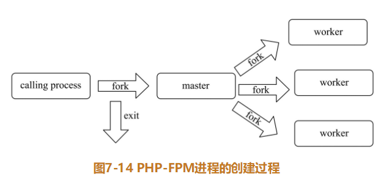

## 生命周期

> 本文内容摘录于《PHP 7底层设计与源码实现》，作者：陈雷等

信号处理

- 可靠信号和非可靠信号，非可靠信号发送多次会丢失，只保留1个。

  

SAPI（Server Application Programing Interface 服务端应用编程接口）

- 核心数据结构 ` _sapi_module_struct `
- 类型
  - CLI SAPI
  - CGI SAPI

SAPI 核心结构SG(v) `sapi_globals` 对应 `_sapi_globals_struct`

### CLI 

5个阶段：模块初始化、请求初始化、执行、请求关闭、模块关闭

1、模块初始化

- FPM 模式，进程启动后只会进行一次模块初始化，进而进入循环，进行请求的初始化

  

2、请求初始化

3、执行

入口函数是 `php_execute_script`

4、请求关闭

主要工作如下：

1）调用各模块中注册的关闭函数和析构函数。

2）将输出缓冲器中的内容输出。

3）调用所有扩展注册的钩子RSHUTDOWN函数。

4）销毁request相关的全局变量，关闭编译器和执行器。

5）还原ini配置。

完成这些工作后，FPM 模式会循环等待请求的到来， 继续进行请求初始化。而CLI 模式会直接进入最后一个阶段。

5、模块关闭

与模块初始化阶段工作相反，主要工作：

1）调用加载模块对应的flush函数，清理持久化符号表，销毁所有模块；

2）关闭与php.ini配置文件解析相关的变量和函数；

3）关闭内存管理和垃圾回收机制；

4）关闭output输出相关的信息；

5）销毁core_globals。

### FPM

FPM 模式和 CLI 模式类似，同样有5个阶段，不同的是，FPM是常驻内存进程，模块初始化和模块关闭都只做一次，模块初始化之后，进入循环，等待请求的到来。

PHP-FPM 是多进程的服务，其中有1个 master 进程（管理工作）和多个 worker 进程（处理数据请求）

PHP-FPM的三种模式：static、dynamic、ondemand。在 php-fpm.conf 的 pm = static 

static ：固定数量的子进程

dynamic ：动态变化，启动时，会创建固定数量的子进程，随后按需创建。空闲的子进程超过限制时，才杀死进程。

ondemand ：内存放在第一位，当空闲子进程在持续空闲特定时间后，会被杀死。这样导致在服务器长时间没有请求时， 服务器内存会节省很多，但是相应地，在高峰期或设置空闲时间过短时，无法避免频繁创建子进程的问题。

webserver 运行过程

Client 通过 HTTP方式请求 nginx，nginx 的worker进行处理，转成对应的 FastCGI，请求 FPM，FPM的worker 进程进行处理，执行完毕后，返回 nginx，再一步返回 client

php-fpm启动时，首先启动一个calling process，然后由calling process创建master进程，master进程根据需要创建的子进程数创建work进程，其中master进程的title为php-fpm: master process，而worker进程的名称为php-fpm: pool name，其中name在php-fpm.conf 文件开头设置 :   [www]

整个FPM模式实际上是多进程模式，首先由calling process进程fork出master进程，master进程会创建Socket，然后fork出worker进程，worker进程会在accept处阻塞等待，请求过来时，由其中一个worker进程处理，按照FastCGI模式进行各阶段的读取，然后解析PHP并执行，最后按照FastCGI协议返回数据，继续进入accept处阻塞等待。另外，FPM建立了计分板机制，可以关注全局和每个woker的工作情况，方便使用者监控。