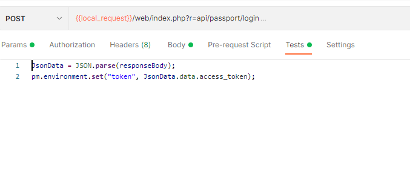
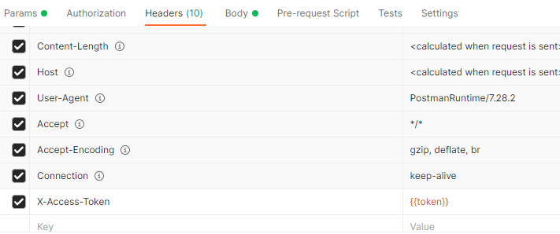

# postman接口后置操作之登录记录token到变量

:memo:  2021年7月28日10:17

日常使用 ` postman ` 接口调试的时候，会遇到需用登录后才能使用的接口，这时候就需要进行访问登录接口，获取到 ` token `后再进行请求。

每次登录获取回来的 ` token ` 都是不一样的，携带` token `请求的接口，每次` token `改变后，又需要更新` token `才能继续请求。

这时候，我们可以把每次登录后获取回来的` token `值保存到一个环境变量里面，需要携带` token `的接口直接使用这个环境变量就可以了，而且每次登录，也可以自动根据返回来的` token `值进行更新。

## 步骤

- 在接口的 ` Tests ` 操作栏下，读取到返回来的响应体
- 设置环境变量` token `
- 接口中使用` {{token}} `访问即可

下图中为在` header `中使用环境变量

