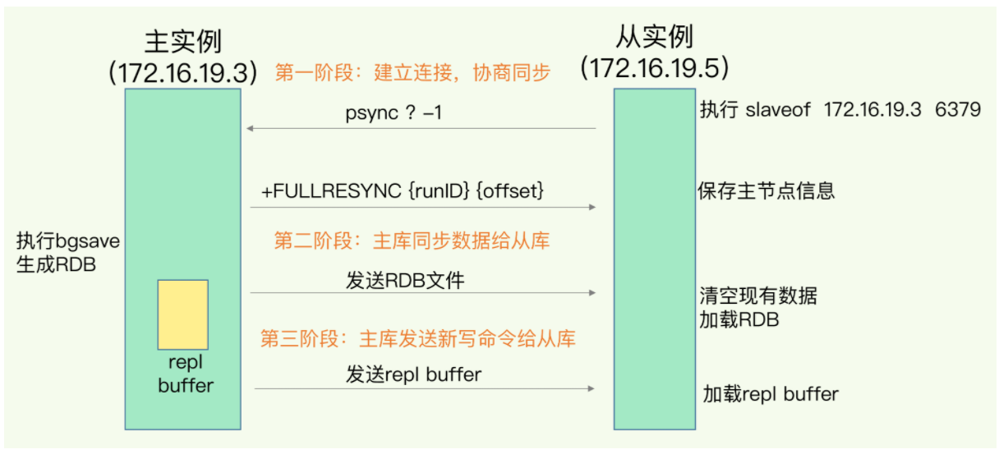
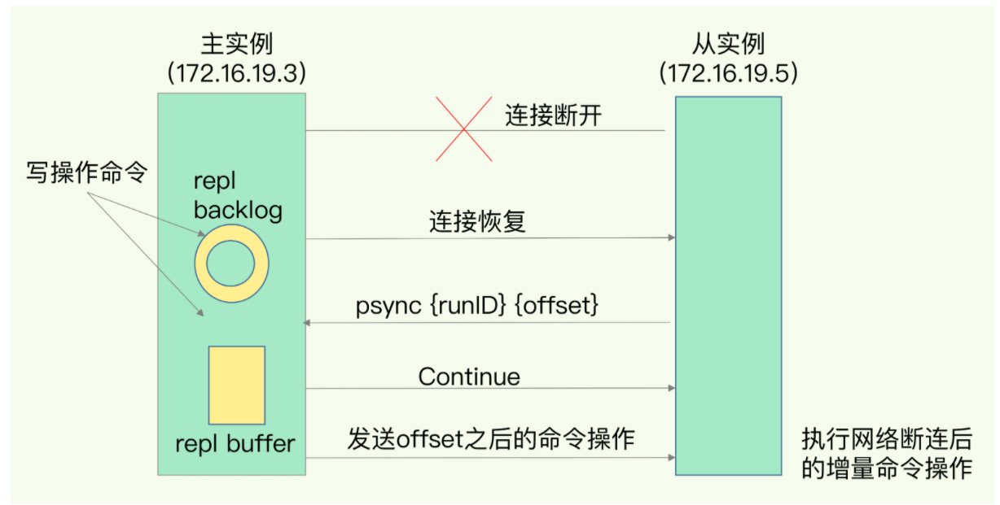

## 疑问汇总


**什么是Redis？Redis 为什么快？**

内存高速缓存数据库。Remote Dictionary Server （远程数据服务），C 语言编写的，key-value 存储系统，支持丰富的数据类型。

快的原因：

- 基于内存，无需磁盘IO
- 单线程，避免不必要的上下文切换和竞争，无需考虑锁的问题
- C 语言开发，接近底层操作
- 多路 I/O 复用模型，非阻塞IO
  - 多路复用。让单个线程高效的处理多个网络连接请求
  - 非阻塞IO 内部实现采用 epoll 
- 数据结构简单


**平常使用 Redis 都是在哪些场景？**

- 热点数据的缓存
  - 读取数据先读取缓存，缓存没有再读取数据库，这时候需要注意缓存击穿。
- 限时业务的运用
  - 手机验证码，一些限时活动等
- 计数器
  - 秒杀限购
  - 接口限制请求次数等
- 分布式锁
  - setnx：set if not exists 
  - 争抢数据
- 排行榜 zset
- 点赞、好友等相互关系的存储 : sort
- 简单队列


**Redis 的持久化有哪几种？有什么区别？实现的原理是怎样的？**

RDB：把当前进程数据生成快照保存到磁盘

- 手动触发和自动触发


手动触发：`save`  和 `bgsave`

- save 阻塞当前服务器，直到RDB过程结束
- bgsave fork 子进程，子进程负责RDB过程

自动触发：redis.conf 中配置RDB

```
# 周期性执行条件的设置格式为
save <seconds> <changes>

# 默认的设置为：
save 900 1
save 300 10
save 60 10000

# 以下设置方式为关闭RDB快照功能
save ""
```

- 900 秒内有1条key信息发生变化，则进行快照
- 300 秒内有10条key信息发生变化，则进行快照
- 60 秒内有10000条key信息发生变化，则进行快照


AOF：写后日志，即先写内存，后写日志

AOF日志记录 redis 的每个命令，步骤：命令追加（ append ），文件写入（ write ）和文件同步（ sync ）。

- 命令追加：服务器执行一个写命令后，会把该命令追加到 aof_buf 缓冲区
- 文件写入和同步：读取 aof_buf 缓冲区的内容，写入 AOF 文件， Redis 提供了 3 种回写策略。
  - Always：同步写回
  - Everysec：每秒写回
  - No：操作系统操作写回


**Redis 的事务了解吗？事务都有哪些注意的地方？**

Redis 事务的本质是一组命令的集合。事务支持一次执行多个命令，一个事务中所有命令都会被序列化。在事务执行过程，会按照顺序串行化执行队列中的命令，其他客户端提交的命令请求不会插入到事务执行命令序列中。

总结说：redis事务就是一次性、顺序性、排他性的执行一个队列中的一系列命令。

redis 事务不支持回滚操作。


- 相关命令

  > MULTI 、 EXEC 、 DISCARD 和 WATCH 是 Redis 事务相关的命令。

  - MULTI：开启事务，把后续命令 放入队列中，然后使用 EXEC 原子性执行这些命令
  - EXEC：执行命令
  - DISCARD：取消事务，放弃执行所有命令
  - WATCH：监视一个或多个key,如果事务在执行前，这个key(或多个key)被其他命令修改，则事务被中断，不会执行事务中的任何命令
  - UNWATCH：取消监视


**Redis 都有哪些数据类型？你是怎么选择数据类型的？底层的数据结构是怎么样的？**

| 类型          | 结构存储的值                  | 结构读写能力                                              | 底层数据结构        | 应用场景                  |
| ------------- | ----------------------------- | --------------------------------------------------------- | ------------------- | ------------------------- |
| String 字符串 | 字符串、整数、浮点数          | 字符串操作；整数或浮点数的自增或自减操作                  | SYS                 | 缓存、计数器、session     |
| List 列表     | 链表， 每个节点包含一个字符串 | 链表的push、 pop 操作，读取单个或多个元素；根据值查找元素 | QuickList           | TimeLine时间轴 、消息队列 |
| Set 集合      | 包含字符串的无序集合          | 交集，并集，差集等                                        | HashTable，IntSet   | 标签，收藏                |
| Hash 散列     | 键值对的无序散列表            | 添加，删除，获取                                          | HashTable， ZipList | 缓存，用户信息等          |
| Zset 有序集合 | 存储键值对                    | 有序集合，可根据分值范围获取元素                          | ZipList，ZSkipList  | 排行榜                    |


使用列表的技巧

- lpush + lpop = 栈
- lpush + rpop = 队列
- lpush + ltrim = 有限集合
- lpush + brpop = 消息队列


SYS  ：简单动态字符串

ZipList：压缩列表

QuickList：快表

Dict：字典/哈希表

IntSet：整数集

ZSkipList：跳表


3 种特殊类型

- HyperLogLogs 基数统计
  - 统计计数：注册IP数，每日访问数等
- Bitmap 位存储
  - 只有 0 / 1 状态的记录，如签到
- geospatial 地理位置
  - 两地之间的距离，方圆几里的人


**Redis 能够实现命令批处理吗？**

管道技术


**Redis 的哨兵机制了解吗？实现原理是怎么样的？**

- 监控：不断检查主从结点是否正常运作
- 自动故障转移：当主节点不能正常工作，自动推举新的主节点
- 配置提供者：连接哨兵获取当前主节点的地址
- 通知：故障转移结果通知到客户端

哨兵实例之间通过pub/sub 发布订阅机制

**哨兵监控：**向主库发送 info 命令获取到从库实例，建立连接

**主库下线判定**

- 主观下线：任何一个哨兵检测，并作出Redis节点下线的判断
- 客观下线：由哨兵集群共同决定节点是否下线，投票决定

**哨兵集群选举机制**

Raft选举算法：选举的票数大于等于 num(sentinels)/2 + 1时，将成为领导者，否则继续选举。

成为哨兵Leader满足条件：

- 拿到半数以上的赞成票
- 拿到的票数大于等于哨兵配置文件中的 quorum 值

**新主库选出**

- 过滤不健康的从库
- 选择从节点优先级最高的库
- 选择偏移量最大，复制最完整的从节点

**故障转移**

- 选出的 slave-1 脱离从节点，replicaof no one ，升级主节点
- slave-2 指向新的主节点
- 通知客户端主节点已更换
- 原主节点变成从节点，指向新的主节点


**Redis 的主从复制实现原理是怎么样的？如何保证数据一致性？数据延迟又该如何处理？**

- 全量（同步）复制：第一次同步
- 增量（同步）复制：主从库网络断开期间主库收到的命令，同步到从库


全量复制

- 确立主从关系
  - replicaof 主库IP 端口



第一阶段从库发送psync 命令，表示需要进行数据同步，主库启动复制，使用 fullresync 命令响应返回主库ID和复制进度下标。第二阶段，主库发送RDB文件到从库，从库接收到文件后，先清空现有数据，并加载RDB文件。在复制同步过程中，主库发生的命令记录到缓冲区 replication buffer。主库发送RDB文件完成后，再把缓冲区的内容发给从库，这样主从库就实现同步了。


增量复制




- repl_backlog_buffer
  - 主从差异数据环形缓冲区，避免断开连接，重连接后直接执行全量复制。但是如果断开时间太久，缓冲区被覆盖，这时候只能全量复制。
- replication buffer
  - 缓冲区，找到主从差异后，主从库进行数据交互


**利用 Redis 如何实现队列功能？**

- PUB/SUB，订阅/发布模式
  - 无法持久化，网络断开或宕机会造成消息丢失

- 基于List LPUSH + BRPOP 或者 基于 Sorted-Set 
  - 支持持久化，但是不支持多播，分组消费

补充： Stream


**消息发布与订阅有使用过吗？怎么使用的？中间又遇到过什么问题吗？**

无法持久化，如果出现网络异常，redis 宕机，消息就会被抛弃

订阅者只能接收订阅后的消息，订阅前的消息无法接收


- 基于频道 Channel
  - 底层通过字典实现，键为订阅的频道名称，值为订阅的客户端链表
- 基于模式 pattern
  - 链表，每个节点包含订阅模式的客户端，和被订阅的模式


频道

```shell
# 订阅 channel 频道
subscribe channel

# 发布消息到 channel 
publish channel hello
```


模式

```shell
# 模式订阅 
psubscribe c? b* d*
```


**如何解决缓存穿透、击穿和雪崩问题？**

**缓存穿透**：请求缓存和数据库都没有的数据，频繁请求导致数据库压力过大

- 接口层校验，如用户鉴权等

- 缓存取不到的数据，有效时间设置短一点

- 布隆过滤器：快速判断是否一个key 有存在，避免直接暴力访问数据库。hash  set 实现

  

**缓存击穿**：缓存中没有，数据库中有的数据。失效瞬间，数据并发请求数据库，造成问题

缓存失效，瞬间并发请求数据库，导致数据库压力过大。

- 热点数据永不过期
- 接口限流，熔断，降级
- 互斥锁 setnx 


**缓存雪崩**：大量缓存数据同一时间失效，所有请求直接请求到数据库，瞬间导致数据库宕机。

- 热点数据永不过期
- 过期时间设置随机时间


**Redis 作为一个内存型数据库，如何更好的解决内存的占用？**

支持八种淘汰策略。

- 不淘汰
  - no-eviction （4.0后默认）
- 对设置了过期时间的数据中进行淘汰
  - 随机：volatile-random
  - ttl：volatile-ttl，相比随机淘汰，多了过期时间这个参考指标，越快过期的，越优先选择
  - lru：volatile-lru
  - lfu：volatile-lfu
- 全部数据进行淘汰
  - 随机：allkeys-random
  - lru：allkeys-lru
  - lfu：allkeys-lfu


LRU算法

Least Recently Used： 最近最少使用，是一种缓存置换算法。

如果一个数据在最近一段时间没有被用到，那么将来被使用到的可能性也很小，所以就可以被淘汰掉。


LFU算法

Least Frequently Used：最近最频繁使用，根据key的最近被访问的频率进行淘汰，很少被访问的优先被淘汰，被访问的多的则被留下来。


定期删除和惰性删除


**数据库和缓存一致性**

左耳朵耗子的文章：[缓存更新的套路](https://coolshell.cn/articles/17416.html)

更新缓存的的Design Pattern有四种：

- Cache aside
- Read through
- Write through
- Write behind caching


Cache aside ：

- **读的时候**，先读缓存，缓存没有的话，就读数据库，然后取出数据后放入缓存，同时返回响应。

- **更新的时候**，先更新数据库，然后再删除缓存。

  

具体逻辑：

- **失效**：应用程序先从cache取数据，没有得到，则从数据库中取数据，成功后，放到缓存中。
- **命中**：应用程序从cache中取数据，取到后返回。
- **更新**：先把数据存到数据库中，成功后，再让缓存失效。


情况：删除缓存失败

方案一：队列 + 重试机制

方案二：异步更新缓存（基于订阅 binlog 的同步机制）