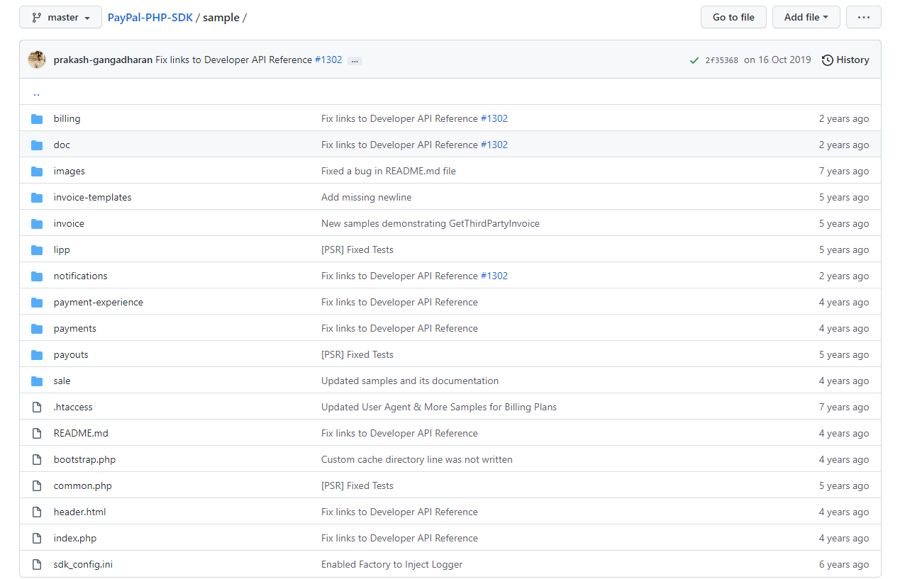

## PayPal支付对接


背景：香港PC商城接入PayPal支付。


### 支付流程

1、当点击PayPal 按钮的时候，会触发js的CreateOrder函数，调用Create Payment(pyament.php)后台的URL。

2、在调用Create Payment 后台的URL上，调用PayPal Create Payment API。调用API 请求（[https://developer.paypal.com/docs/api/payments/v1/#payment_create](https://developer.paypal.com/docs/api/payments/v1/#payment_create)）

3、返回token（res.token）。到这里整个Create Order函数结束，如果API调用成功，会弹窗并跳转到PayPal登陆页面。

4、PayPal登陆以后，点击付款按钮时，会触发onApprove方法。

5、传payment id，token, payer id给Execute Payment(successful.php)后台的URL。这个url是在调用Create Payment的时候设置的return_url

6、在Execute Payment后台的URL上调用PayPal的 Execute Payment API。([https://developer.paypal.com/docs/api/payments/v1/#payment_execute](https://developer.paypal.com/docs/api/payments/v1/#payment_execute))


### 创建沙箱账号

1、在 [www.paypal.com](https://www.paypal.com) 官方网站创建一个账号（开发调试的话，创建个人账号即可）。

2、登录 [developer.paypal.com](https://developer.paypal.com)

3、点击左侧菜单栏的` SANDBOX `下的 ` Accounts ` 可以看到系统默认创建的2个账号。这2个账号都是可以编辑信息的，当然也可以使用默认的信息。

- `Business` 是商家账号（后面商家账号会用到设置异步回调通知）
- `Personal` 是个人账号（用于调试支付时登录）


### 创建应用

这里应用的概念，在我理解和支付宝支付里面创建的应用差不多，可以看做是使用PayPal支付的一个主体，一个商家账号下面可以有多个主体。


点开` Default Application `这个应用，可以看到关联的沙箱账号，`clientID` 和 `clientSecret `，这两个参数用于后续请求支付参数等操作。


### 示例

【官方开源SDK】[https://github.com/paypal/PayPal-PHP-SDK](https://github.com/paypal/PayPal-PHP-SDK)

sample 目录下是各种不同的示例。




以下是我在项目中的代码。

示例HTML

```html
<body>
  <script src="https://www.paypal.com/sdk/js?client-id=上面提到的client-id"></script>
  <div id="paypal-button-container"></div>
  <script>
   paypal.Buttons({
      style:{
        color:'silver', //gold, blue, silver, white, black
        size: 'small'
      },
      commit:true,
      createOrder: function () {
        return fetch('createOrder的地址', {
          method: 'get',
          headers: {
            'content-type': 'application/json'
          }
        }).then(function (res) {
          return res.json();
        }).then(function (data) {
            let token;
            token = data.data.approval_url.match(/EC-\w+/)[0];
            return token;
        });
      },
      onApprove: function (data) {
        var DOEC_URL = 'execute的地址';
        return fetch(DOEC_URL, {
          method: 'post',
          headers: {
            'content-type': 'application/json'
          },
          body: JSON.stringify({
            paymentId: data.paymentID,
            token: data.orderID,
            payerID: data.payerID
          })
        }).then(function(res){
          return res.json();
        }).then(function(data){
          console.log(data);
        });
      }
    }).render('#paypal-button-container');
  </script>
</body>
```


后端代码类

```php
namespace app\services;

use PayPal\Api\Amount;
use PayPal\Api\Details;
use PayPal\Api\FlowConfig;
use PayPal\Api\Payer;
use PayPal\Api\Payment;
use PayPal\Api\PaymentExecution;
use PayPal\Api\RedirectUrls;
use PayPal\Api\RefundRequest;
use PayPal\Api\Sale;
use PayPal\Api\Transaction;

class PayPalService
{
    private $clientId;

    private $clientSecret;

    private $is_live = false;// 生产环境

    private $returnUrl;

    private $cancelUrl;

    private $notifyUrl;

    private $currency;

    public function __construct()
    {
        $this->clientId = '';
		$this->clientSecret = '';
		$this->currency = 'USD';// HKD 港币 USD 美元
        $this->returnUrl = '';//批准付款后重定向地址
        $this->cancelUrl = '';//取消付款后重定向地址
		$this->notifyUrl = '';// IPN URL 异步通知地址
    }

    /**
     * @Description 创建订单
     * @Author 沙屿沫
     * @Date 2021/9/26 15:39
     * @param array $params
     * @return array
     */
    public function createOrder(array $params): array
    {
        [
            'order_sn' => $order_sn,
            'description' => $description,
            'total' => $total,
            'subtotal' => $subtotal,
            'shipping' => $shipping,
            'shipping_discount' => $shipping_discount,
            'handling_fee' => $handling_fee,
            'insurance' => $insurance,
            'tax' => $tax,
        ] = $params;
        $demo_params = [
            'order_sn' => '',// 必填
            'description' => '',// 建议必填
            'total' => '',// 必填，全部总额（包含手续费等费用）
            'subtotal' => '',// 必填，总额（除其他费用）
            'shipping' => '',// 建议必填，运费
            'shipping_discount' => '',// 选填，运费折扣，负数减
            'handling_fee' => '',// 选填，手续费
            'insurance' => '',// 选填，保险费
            'tax' => '',// 选填，税费
        ];

        $apiContext = new \PayPal\Rest\ApiContext(
            new \PayPal\Auth\OAuthTokenCredential(
                $this->clientId,//client ID
                $this->clientSecret //secret ID
            )
        );

        if ($this->is_live) {
            $apiContext->setConfig(array('mode'=>'live'));
        }

        $flow = new FlowConfig();
        $flow->setLandingPageType('Billing');

        $payer = new Payer();
        $payer -> setPaymentMethod('paypal');

        $redirectUrls = new RedirectUrls();
        $redirectUrls -> setReturnUrl($this->returnUrl)
            -> setCancelUrl($this->cancelUrl);

        $details = new Details();

        $shipping_discount && $details->setShippingDiscount($shipping_discount);
        $handling_fee && $details->setHandlingFee($handling_fee);
        $insurance && $details->setInsurance($insurance);
        $tax && $details->setTax($tax);

        $details->setShipping($shipping)
            ->setSubtotal($subtotal);

        $amount = new Amount();
        $amount->setCurrency($this->currency)->setTotal($total)->setDetails($details);

        $transaction = new Transaction();
        $transaction -> setAmount($amount)
            -> setDescription($description)
            -> setInvoiceNumber($order_sn); //订单Id

        $this->notifyUrl && $transaction->setNotifyUrl($this->notifyUrl); //IPN URL

        $payment = new Payment();
        $payment -> setIntent('sale')
            -> setPayer($payer)
            -> setRedirectUrls($redirectUrls)
            -> setTransactions(array($transaction));

        try{

            $payment -> create($apiContext);
            $approval_url = $payment -> getApprovalLink();
            return compact('approval_url');// 根据示例html 
//            return json_decode($payment->toJSON(128), true);

        } catch(\PayPal\Exception\PayPalConnectionException $ex){
            \Yii::error('PayPalConnectionException: '. $ex->getCode().' --- '.$ex->getData());
            throw $ex;

        } catch (\Exception $ex){
            throw $ex;
        }
    }

    /**
     * @Description 确认扣款
     * @Author 沙屿沫
     * @Date 2021/9/26 15:39
     * @param string $payerId
     * @param string $paymentId
     * @return array
     */
    public function execute(string $payerId, string $paymentId): array
    {
        $apiContext = new \PayPal\Rest\ApiContext(
            new \PayPal\Auth\OAuthTokenCredential(
                $this->clientId,//client ID
                $this->clientSecret //secret ID
            )
        );

        if ($this->is_live) {
            $apiContext->setConfig(array('mode'=>'live'));
        }

        $payment = Payment::get($paymentId, $apiContext);
        $execution = new PaymentExecution();
        $execution -> setPayerId($payerId);

        try {
            $result = $payment -> execute($execution, $apiContext);
            return json_decode($result->toJSON(128), true);
        } catch (\PayPal\Exception\PayPalConnectionException $ex) {
            throw $ex;
        } catch (\Exception $ex){
            throw $ex;
        }
    }


    /**
     * @Description查询订单
     * @Author 沙屿沫
     * @Date 2021/9/26 15:39
     * @param string $order_sn
     * @return mixed
     */
    public function query(string $sale_id)
    {
        $apiContext = new \PayPal\Rest\ApiContext(
            new \PayPal\Auth\OAuthTokenCredential(
                $this->clientId,//client ID
                $this->clientSecret //secret ID
            )
        );

        if ($this->is_live) {
            $apiContext->setConfig(array('mode'=>'live'));
        }


        try {
            $demo_result = '{"id":"1DU410917H5745019","state":"completed","amount":{"total":"0.99","currency":"USD","details":{"subtotal":"0.99"}},"payment_mode":"INSTANT_TRANSFER","protection_eligibility":"ELIGIBLE","protection_eligibility_type":"ITEM_NOT_RECEIVED_ELIGIBLE,UNAUTHORIZED_PAYMENT_ELIGIBLE","transaction_fee":{"value":"0.33","currency":"USD"},"invoice_number":"HM4cf42be81cf793d8c7b54a01e99e87","parent_payment":"PAYID-MFIBXZQ2F2665569K055620G","create_time":"2021-09-26T07:06:32Z","update_time":"2021-09-26T07:06:32Z","links":[{"href":"https://api.sandbox.paypal.com/v1/payments/sale/1DU410917H5745019","rel":"self","method":"GET"},{"href":"https://api.sandbox.paypal.com/v1/payments/sale/1DU410917H5745019/refund","rel":"refund","method":"POST"},{"href":"https://api.sandbox.paypal.com/v1/payments/payment/PAYID-MFIBXZQ2F2665569K055620G","rel":"parent_payment","method":"GET"}]}';
            $result = Sale::get($sale_id, $apiContext);

        } catch (\Exception $exception) {
            print($exception);
            exit();
        }

        return json_decode($result->toJSON(128), true);
    }

    /**
     * @Description 订单退款
     * @Author 沙屿沫
     * @Date 2021/9/26 15:39
     */
    public function refund(string $sale_id, string $refund_money)
    {
        $amt = new Amount();
        $amt->setCurrency($this->currency)
            ->setTotal($refund_money);

        $refundRequest = new RefundRequest();
        $refundRequest->setAmount($amt);

        $sale = new Sale();
        $sale->setId($sale_id);

        $apiContext = new \PayPal\Rest\ApiContext(
            new \PayPal\Auth\OAuthTokenCredential(
                $this->clientId,//client ID
                $this->clientSecret //secret ID
            )
        );

        if ($this->is_live) {
            $apiContext->setConfig(array('mode'=>'live'));
        }

        try {
            $demo_result = '{"id":"9WW2694970862104R","state":"completed","amount":{"total":"0.99","currency":"USD"},"refund_from_received_amount":{"value":"0.96","currency":"USD"},"refund_from_transaction_fee":{"value":"0.03","currency":"USD"},"total_refunded_amount":{"value":"0.99","currency":"USD"},"parent_payment":"PAYID-MFIBXZQ2F2665569K055620G","sale_id":"1DU410917H5745019","create_time":"2021-09-27T03:39:25Z","update_time":"2021-09-27T03:39:25Z","links":[{"href":"https://api.sandbox.paypal.com/v1/payments/refund/9WW2694970862104R","rel":"self","method":"GET"},{"href":"https://api.sandbox.paypal.com/v1/payments/payment/PAYID-MFIBXZQ2F2665569K055620G","rel":"parent_payment","method":"GET"},{"href":"https://api.sandbox.paypal.com/v1/payments/sale/1DU410917H5745019","rel":"sale","method":"GET"}]}';
            $result = $sale->refundSale($refundRequest, $apiContext);
        } catch (\Exception $exception) {
            print($exception);
            exit();
        }

        return json_decode($result->toJSON(128), true);
    }

    /**
     * @Description 订单通知
     * @Author 沙屿沫
     * @Date 2021/9/26 15:39
     * @param array $data
     * @throws \Exception
     */
    public function notify(array $data)
    {
        $demo_data = [
            'mc_gross' => '0.02',
            'invoice' => '614d8f401d847',//
            'protection_eligibility' => 'Eligible',
            'address_status' => 'confirmed',
            'payer_id' => 'KJSDP2SHURBL4',
            'address_street' => 'NO 1 Nan Jin Road',
            'payment_date' => '01:42:04 Sep 24, 2021 PDT',
            'payment_status' => 'Completed',
            'charset' => 'gb2312',
            'address_zip' => '200000',
            'first_name' => 'John',
            'mc_fee' => '0.02',
            'address_country_code' => 'CN',
            'address_name' => 'Doe John',
            'notify_version' => '3.9',
            'custom' => '',
            'payer_status' => 'verified',
            'business' => 'sb-oarsk7805857@business.example.com',
            'address_country' => 'China',
            'address_city' => 'Shanghai',
            'quantity' => '1',
            'verify_sign' => 'A-on.2dE-HD0drM32ZIE1tBYMyPgAwyGxgTmK4t-mnBRnYKgqGgp0Ens',
            'payer_email' => 'sb-fkppe7805825@personal.example.com',
            'txn_id' => '78H69914TW0115549',
            'payment_type' => 'instant',
            'last_name' => 'Doe',
            'address_state' => 'Shanghai',
            'receiver_email' => 'sb-oarsk7805857@business.example.com',
            'payment_fee' => '0.02',
            'shipping_discount' => '0.00',
            'insurance_amount' => '0.00',
            'receiver_id' => 'TY6C65BAP5JD6',
            'txn_type' => 'express_checkout',
            'item_name' => 'Testing Request',
            'discount' => '0.00',
            'mc_currency' => 'USD',
            'item_number' => '',
            'residence_country' => 'CN',
            'test_ipn' => '1',
            'shipping_method' => 'Default',
            'transaction_subject' => 'Testing Request',
            'payment_gross' => '0.02',
            'shipping' => '0.00',
            'ipn_track_id' => '8aac94e9740a0',
        ];

        if (strtolower($data['payment_status']) === 'completed') {

            // 查询PayPal订单实际支付状态
            $order = $this->query($data['txn_id']);
            if ($order['state'] !== 'completed') {
                throw new \Exception('PayPal订单状态异常');
            }

            // 业务逻辑...
        }
    }
}
```

